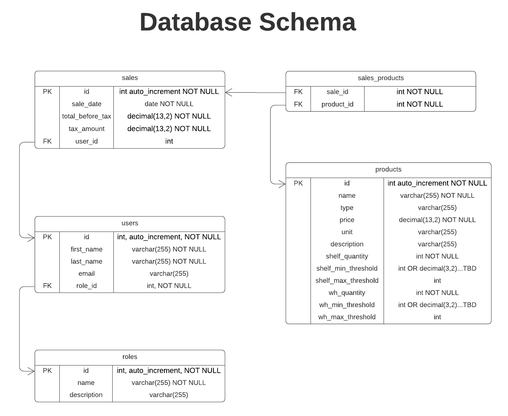

# CS361-Group Project

A store inventory management system, built in [stack details here].

### Architecture

### Contributors
* Kevin Joy - joyke@oregonstate.edu
* George Kochera - kocherag@oregonstate.edu
* Blake Lester - lesterst@oregonstate.edu
* Quinn Wilkins - wilkinsq@oregonstate.edu
* Ellen Yang - yange@oregonstate.edu

### Technology Stack

The Apple Cart uses a simple, lightweight technology stack.

Front-End      | Back-End
---------------|---------
HTML           |  Node.JS
Bootstrap CSS  |  Express
&nbsp;         |  My SQL

### Database Design

### Setup

1. Make sure you have a version of Node.JS installed on your machine. Every system and setup is a bit different so the best instructions can be found at [Node.JS](https://nodejs.org/en/).
2. Clone the repository to your machine in whichever manner suits you best. Command-line or via an IDE.
3. Open a terminal/command-prompt window and navigate to the folder containing 'app.js'.
4. Run the following command:
`npm install package.json`
This will install all the dependencies for our team's app for you, on your local machine. (Things like handlebars, express and anything we may implement later.)

At this point, the web app is 'installed' and ready to use. Anytime you want to run the app, you would do the following from the command-line in the folder that contains 'app.js'
`node app.js`
As long as you do not get any errors, you should be able to open up your browser, and navigate to http://localhost:8080. This is the running instance of the web app. 

### Standards

- Handlebars is set to use *.hbs file-extension. To save everyone from having to type *.handlebars when creating new templates.
- The ClearDB (MySQL) database credentials are stored in process.env.CLEARDB_DATABASE_URL
- All static assets such as pictures, icons, JS files, and stylesheets can be stored in ./public and the path to those assets can be referred to in HTML as './css/example.css' or './img/apple_cart.jpg' as examples.
- When writing SQL queries, use the following convention to avoid possible conflicts down the road: (1) table and attribute references are all lowercase (2) SQL commands and reserved words are all caps. Ex: `SELECT first_name, last_name FROM users WHERE id = 1`

### Github Best Practices

- Alwasys work in a local branch (NOT local master). 
  - If you are unsure which branch you are in, type "git branch" and it will show you all branches, as well as highlight the one you are in.
- "git branch" should be your favorite command and you should use it freqently to ensure you are not changing your local master.
- Should should only have to clone the github repository one time in the beginning. For the remainder of the project, you can use "git status" to check if your local master is up to date with the remote master on git hub. If it is not, you can use "git pull" to update your local master.

Assumed from here: you have a cloned github copy on your desktop, you have no unmerged branches, you want to add a new feature
- In terminal, navigate to your local github repository
- use "git branch" to determine what branch you are in
- use "git checkout master" to navigate to your local master
- use "git status" to determine if you are in sync with the remote master on git hub
- use "git pull" to pull in any changes and update your local master to match git hub (not needed if there are no changes)
- use "git branch <name>" to create a new local branch based on your now updated local master
- use "git checkout <name>" to switch to the new branch
- Make any changes that you want to make localy
- use "git status" to see changes
- use "git diff" to review the differences line by line
- use "git add <filename>" to designate the file you want to push to git hub
- use "git add <filename>" again if you have another file to add (it will highlight all files added)
    - Note: Erroneous files may appear here. Some are hidden files automatically created by your computer or system. You can add these to the gitignore file on     github and you won't have to see them again.
- use "git commit -m "your message here" to commit the changes on your local branch, add a breif message on what the commit changes
- use "git branch" one more time to ensure you are working in your local branch
- use "git push" to push the local branch to github and create a new remote branch on git hub

Log into git hub and navigate to the branch you've just created to review your changes. If you are satisfied, you can create a "pull request" and add your programing partner as the person you are requesting to review the code.

Once the code is reviewed, your programming partner can merge the code to master, and all is done!

